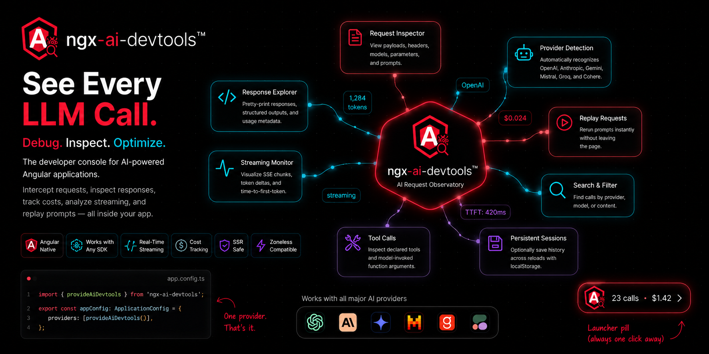

# ngx-ai-devtools

> Network-tab-style DevTools for LLM calls in Angular apps. See every prompt, response, token, and dollar your app spends — without leaving the browser.

[](https://www.npmjs.com/package/ngx-ai-devtools)
[](LICENSE)
[](https://angular.dev)

<p align="center">
  
</p>

You're building an Angular app that talks to OpenAI, Anthropic, or Gemini. Every call you make is a small mystery: what did you actually send, what came back, how many tokens did it cost, and was the streaming response chunked the way you expected? `console.log` doesn't cut it. The browser Network tab doesn't parse the body. You end up writing yet another logger.

`ngx-ai-devtools` is that logger, except it's already written, looks good, and ships inside your app behind one provider call.

## What it does

- **Intercepts every LLM call** your app makes (`fetch`, `HttpClient`, OpenAI SDK, Anthropic SDK, Vercel AI SDK — anything that goes over `fetch`).
- **Auto-detects the provider** (OpenAI, Anthropic, Google Gemini, Mistral, Groq, Cohere) and parses the request and response into a structured view.
- **Calculates cost** per call using an embedded price table. Running total for your session lives in the launcher button.
- **Handles streaming** (SSE) for OpenAI and Anthropic. Accumulates deltas in real time. Tracks time-to-first-token.
- **Shows tool calls** as a first-class view — declared tools, model-issued calls with arguments.
- **Replays a call** with one click so you can iterate on prompts without leaving the page.
- **Built on signals.** Zero RxJS in the public API. Standalone components. SSR-safe. Tree-shakeable. Zoneless-compatible.

## Install

```bash
npm install ngx-ai-devtools
```

Requires Angular 18.1 or newer (signals + standalone APIs + `@let`).

## Usage

Add `provideAiDevtools()` to your application config. That's the whole setup.

```ts
// app.config.ts
import { ApplicationConfig } from '@angular/core';
import { provideAiDevtools } from 'ngx-ai-devtools';
import { environment } from './environments/environment';

export const appConfig: ApplicationConfig = {
  providers: [
    provideAiDevtools({
      enabled: !environment.production,
    }),
  ],
};
```

A floating launcher pill appears in the bottom-right of your app. Make an LLM call — from anywhere, with any SDK — and it shows up.

```ts
// Works with the official SDKs, no extra config:
import OpenAI from 'openai';
const openai = new OpenAI({ apiKey: '...', dangerouslyAllowBrowser: true });
await openai.chat.completions.create({ model: 'gpt-4o', messages: [...] });

// Works with raw fetch:
await fetch('https://api.anthropic.com/v1/messages', { ... });

// Works with Angular's HttpClient:
this.http.post('https://api.openai.com/v1/chat/completions', { ... }).subscribe();
```

## Configuration

Every option is optional.

| Option | Type | Default | What it does |
|---|---|---|---|
| `enabled` | `boolean` | `true` | When `false`, no patching, no UI. Gate this on `!environment.production`. |
| `maxCalls` | `number` | `100` | Maximum calls retained in memory. Older ones drop FIFO. |
| `persist` | `boolean` | `false` | Persist call history to `localStorage` across reloads. |
| `autoMount` | `boolean` | `true` | Auto-inject the UI into `document.body`. Set to `false` if you'd rather place `<ngx-ai-devtools />` explicitly. |
| `position` | `'bottom-right' \| 'bottom-left' \| 'top-right' \| 'top-left'` | `'bottom-right'` | Launcher position. |
| `redact` | `boolean` | `false` | Hide request/response bodies in the UI (still recorded). Useful for sharing screenshots. |
| `additionalEndpoints` | `string[]` | `[]` | Extra URL substrings to treat as LLM endpoints. Use this for custom proxies. |

## Programmatic access

The store is a public signal-based service. Use it in your own components, dashboards, or test assertions.

```ts
import { Component, inject } from '@angular/core';
import { AiDevtoolsService } from 'ngx-ai-devtools';

@Component({ ... })
export class CostBadge {
  private svc = inject(AiDevtoolsService);
  totalCost = computed(() => this.svc.stats().totalCost);
}
```

The service exposes:

- `calls: Signal<LlmCall[]>` — all recorded calls, newest first.
- `filtered: Signal<LlmCall[]>` — current filtered view.
- `selected: Signal<LlmCall | null>` — currently selected call.
- `stats: Signal<{ count, totalCost, totalTokens, avgLatency }>` — running aggregates.
- `clear()`, `setOpen()`, `select()`, `setFilter()`, `replay()`.

## Why this exists

I kept building AI features and kept opening DevTools' Network tab, copying the request body, pretty-printing it in another window, then doing the same for the response, then mentally calculating cost. Then I'd do it again ten minutes later. So I built the panel I wanted, and made it good enough that you'd actually want to ship it in your dev environment.

It's not a replacement for production observability (LangSmith, Helicone, Langfuse — use those when you're past prototyping). It's the debugger you want while you're still figuring out what to ship.

## What's intentionally not here yet

- LangSmith / Helicone export
- Cost budgets and alerts
- Diff view between two calls
- React adapter (this is Angular-first, on purpose)
- Persistent storage beyond localStorage

If you want any of those, open an issue. PRs welcome.

## Provider support

| Provider | Request parsing | Response parsing | Streaming | Cost |
|---|---|---|---|---|
| OpenAI | ✅ | ✅ | ✅ | ✅ |
| Anthropic | ✅ | ✅ | ✅ | ✅ |
| Google Gemini | ✅ | ✅ | partial | ✅ |
| Mistral | ✅ (OpenAI-shape) | ✅ | ✅ | ✅ |
| Groq | ✅ (OpenAI-shape) | ✅ | ✅ | ✅ |
| Cohere | detected | partial | — | — |

## Development

```bash
git clone https://github.com/Anas-Khan93/ngx-ai-devtools.git
cd ngx-ai-devtools
npm install
npm start             # serves the demo at http://localhost:4200
npm run build:lib     # produces dist/ngx-ai-devtools
```

## License

MIT © Anas Khan
